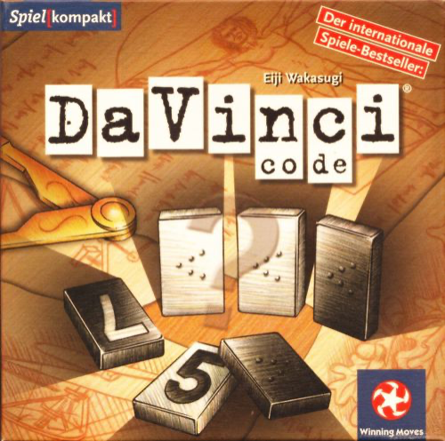
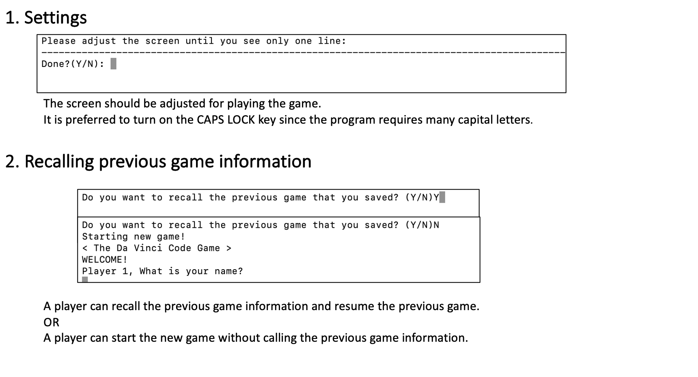
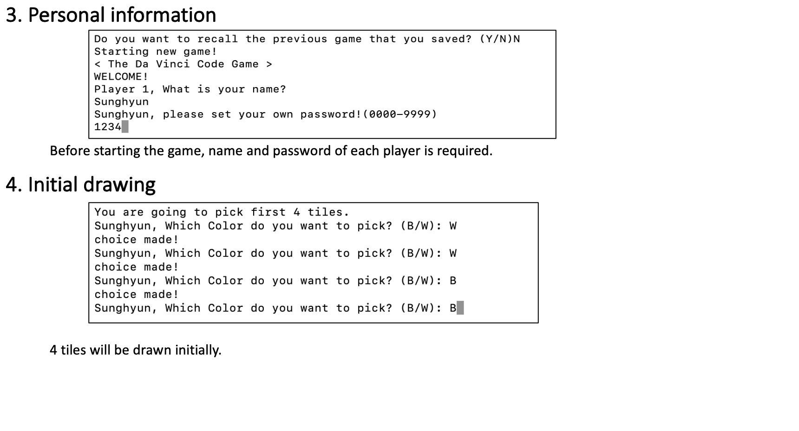
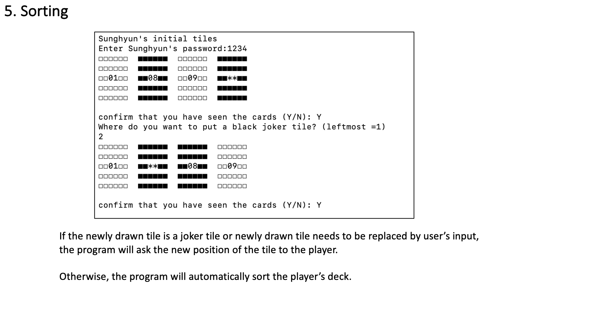
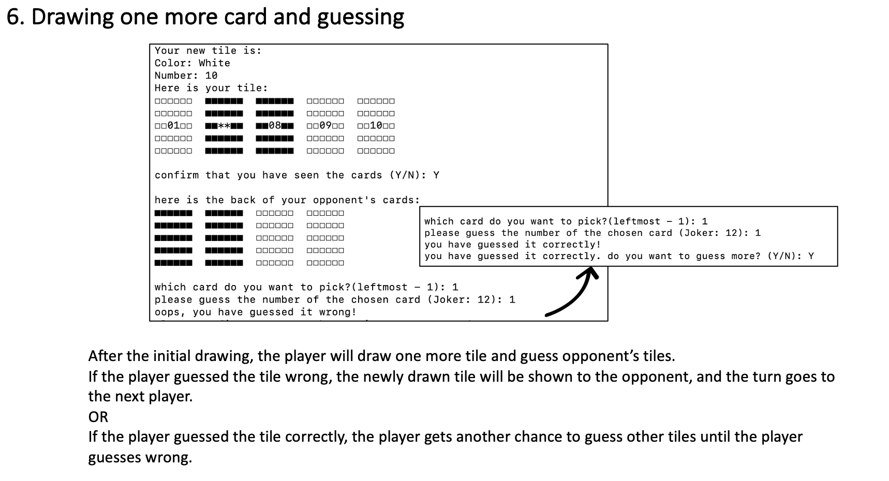
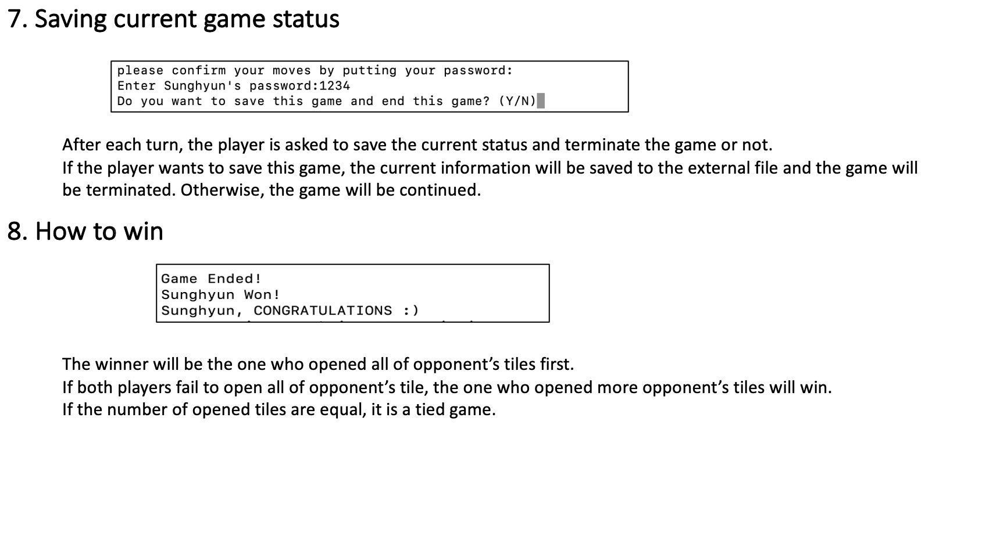

# The Da Vinci Code Game
##### *A text-based game for COMP2113/ENGG1340 Project*
##### *Group 108 - Sunghyun Kim (3035603526) and Jinho Kwak (3035552129)*

## About Game Rules
This particular text-based game is inspired from *“Da Vinci code”*, a famous strategy board game.
This game is for two players. In this game, there are a total of 24 tiles, either in black or white.
Each color tiles show 1 to 11 and one joker(**) tile.

*NOTE: The screen resolution must be at least 1440x900 to play this game.*

**At the start of the game, the players do the following:**
1. Each of the two players take 4 tiles (initial draw) from the deck of 24 tiles regardless of each tiles’ color (Black/White).
2. The players sort the tiles in ascending order from left to right (this will be done automatically by the program, unless the player draws joker). If two tiles show the same number, the white tile should go to the left.
3. If either black or white joker is drawn, player(s) will be asked to position the joker wherever they want.
4. After the initial draw, the players proceed to *take turns.*

**Players take turns by doing the following, until the end of game:**

1. Player 1 takes a tile from the remaining deck and rearranges the tiles (this will be done automatically by the program, unless the player draws joker)
2. If either black or white joker is drawn, player(s) will be asked to position the joker wherever they want.
3. Player 1 guesses a tile of player 2 by typing the position and guessed number of the opponent's tile. There will be 2 cases afterwards:
  - If player 1 guesses wrongly, player 1 should open the tile that he/she took in the current turn, and hand the turn to the other player.
  - If player 1 guesses correctly, player 2 opens the guessed tile and player 1 chooses whether he/she will continue to guess or not. If not, the turn goes to player 2. If yes, player 1 keeps guessing (if he/she guesses wrong, he/she should open his/her tile that is chosen in the current turn still).
4. Player 1 decides whether he/she will save and end the game or not. If yes, the information about the current game will be written into three separate files, and the game will terminate. If no, the game will not be saved and the turn goes to the Player 2.
5. After the Player 1's turn, Player 2 does the same (from steps 1-4), and passes the turn again to Player 1.

**The end of the game is reached in the following cases:**
1. If one of the players revealss all of his/her tiles: The player who opened all of the other player’s tiles wins
the game.
2. If deck runs out of cards: the player who has more tiles revealedto the opponent loses.

*Since we have included additional features (saving game information, password, …) in this particular program aside
from adapting aforementioned rules of the game, detailed description of how to play the gram will be provided in the
“Gameplay” section.*

***Adapted from**: Da Vinci code - published in 2004, designed by Eiji Wakasugi*

## Features and Functions
***Note: We did not include any non-standard library in C++ to implement this program***

- **Code Requirement 1:** Generation of random game sets or events

  *Function prototype*: void deal(card deck[], card cards[], int &numberofcards)
  - This takes a random selection of tiles in each draw (initialized by srand(time(NULL)) so that tiles given in every game
will be unique. The developers made sure that the tiles drawn from the deck will not be drawn again.

- **Code Requirement 2:** Data structures for storing game status

  *Struct prototype*: struct card { char color; int number; int shown; };
  - This struct contains information about each tile to be used in the games (color, number, shown/not shown to the opponent). The tiles that players have are represented by the arrays of this struct. The information about the tiles is updated after each turn.

- **Core Requirement 3:** Dynamic memory management

  *Dynamic array*: card * cards=new card [numberofcards];
  - This contains the information about tiles in the player’s deck. After choosing a new tile from the deck, the size of the array increases and the information about new tile is added.
To clear the memories that are used, “ delete []card1, delete []card2, delete []deck “ is used.

- **Code Requirement 4:** File input/output (e.g., for loading/saving game status)

  *For file input:* (recall_data.cpp) #include <fstream>, ifstream fin, fin.open(“player1previnfo.txt), fin.open(“player2previnfo.txt), fin.open(“deckandturnprevinfo)

  *For file output:* (save_data.cpp) #include <fstream>, ofstream fout, fout.open(“player1previnfo.txt), fout.open(“player2previnfo.txt), fout.open(“deckandturnprevinfo)

  - After each turn, the program asks the players whether to save current information about the game or not. If yes, the information will be saved in an external file and terminate the game. Then, before executing the main function, the program will ask players whether to recall previous information about the game. If yes, the external files will be called and opened.

- **Code Requirement 5:** Program codes in multiple files

  - The program makes functions and codes in separate program files (.h, .cpp) using appropriate headings, and compiles them into one in a specified rule using makefile.

- **Core Requirement 6:** Proper indentation and naming styles

  - The program assigns names to the functions in accordance to their usage (i.e. function with name “deal” for enabling the player to draw 1 tile, function with name “sorting” to sort the tile in ascending order). The program also makes use of proper indentation all the time for the readability of the program.

- **Code Requirement 7:** In-code documentation

  - The developers have added the description for each .cpp file of the game program so that the readers will know what each function does for the whole program. By reading the in-code documentation, the readers will also find where the code requirements are in the parts of the program.

## Brief Manual & Gameplay

## Compilation and execution instructions
1. Download the game files and make sure that the current directory is the same as the game folder.
2. To compile the files, input the command “ $make DAVINCI” in your terminal.
2. To execute the game, input the command “$./DAVINCI” in your terminal.

## Demonstrating Gameplay
Please visit:
https://www.youtube.com/watch?v=V5eXmD2Uj5M
